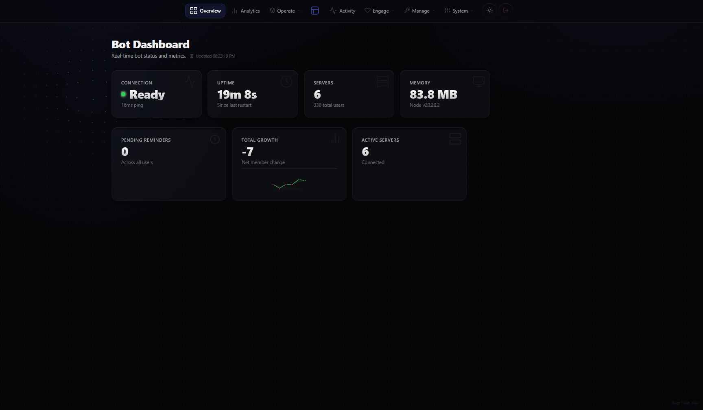
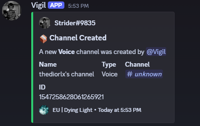
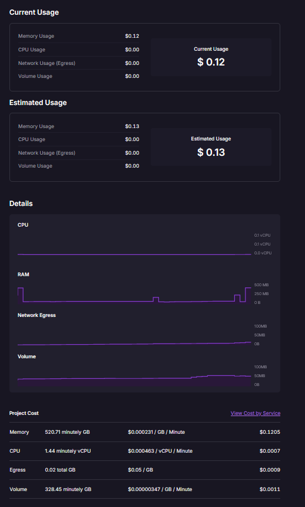
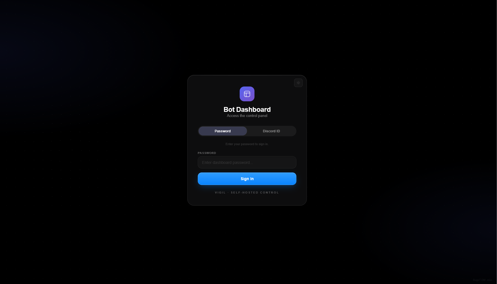

<div align="center">

# Vigil

**Replace Carl-bot, Dyno, and Ticket Tool with one self-hosted Node process.**

Moderation with case files · 16-category logging · tickets with transcripts · a full web dashboard · zero subscriptions, ever

[](https://github.com/mohammad213gh/Vigil/actions/workflows/ci.yml)
[](#testing)
[](https://nodejs.org)
[](https://discord.js.org)
[](LICENSE)

**Deploy it yourself, free:**

[](https://railway.app/new)
[](https://dashboard.render.com/select-repo?type=web)
[](#docker)

</div>

---

## See it running

**The dashboard** — your whole bot, in a browser. Live status, mod tools, ticket builders, analytics. This is the page you land on after login:

<p align="center"></p>

**What logging looks like in Discord** — every event, formatted, searchable, forever:

<p align="center"></p>

**What it costs to run** — my real Railway usage page, four days into the month (the full breakdown is [further down](#what-it-costs-to-run)):

<p align="center"></p>

Twelve cents in four days. **My real-world bill lands between $0.90 and $1.10 a month.** That's the entire cost of replacing a stack of Premium bot subscriptions. The trade: you spend ten minutes on setup instead of five dollars a month, forever.

---

Vigil is a moderation, logging, and community-management bot for Discord that you run yourself, on your own machine. I wrote this doc the way I always wished a README worked: every command is in here, every environment variable, and the reasoning behind the weird decisions. It's long. That's on purpose — hit Ctrl+F and search it.

The short backstory: I run servers. I got tired of reaction roles living behind a "Premium" tab, so I stopped renewing subscriptions and started building. Vigil has been running my communities ever since, more or less nonstop. It's infrastructure first and a project second.

The idea, quickly:

- **It replaces the subscription stack.** Reaction roles, logging, tickets, automod, invites, analytics — the stuff Carl-bot, Dyno, MEE6, and Ticket Tool charge $5–10/month for. One bot, one bill: about a dollar, and that's the *hosting*, paid to nobody but your provider.
- **Every command works two ways.** Slash and prefix (`;` by default) run the exact same code. Same handlers, same cooldowns, same permission checks. Your old habits and your keyboard both work.
- **Boring on purpose.** No microservices, no Redis, no required Docker. Boring is what survives redeploys.
- **I'll tell you what it doesn't do.** No music, no leveling, no economy. I never needed them, so I never built them. More at the [bottom](#what-it-deliberately-is-not).

---

## Table of contents

1. [Features](#features) — every capability, explained in detail
2. [The dashboard](#the-dashboard) — the web panel
3. [Quick start](#quick-start) — from zero to a running bot
4. [Configuration](#configuration) — every environment variable
5. [Data, storage & backups](#data-storage--backups) — the one-file design
6. [Architecture](#architecture) — how it's built, file by file
7. [Testing](#testing) — what's tested, what isn't
8. [Security](#security) — what protects the dashboard, and its honest limits
9. [Deploying](#deploying) — Railway, Docker, VPS
10. [What it costs to run](#what-it-costs-to-run) — real numbers, not vibes
11. [Troubleshooting & FAQ](#troubleshooting--faq) — the answers you'll actually need
12. [License](#license) — free, with two rules

---

## Features

All 70 top-level commands work as slash commands **and** prefix commands (default prefix `;`, per-server configurable). Commands marked 🔓 are public; everything else requires the bot owner or a [`/perm`](#-the-permissions-model) grant.

### 🛡️ Moderation

The standard suite, with the detail that separates a real mod bot from a toy: **every action opens a numbered case**. Who did it, to who, when, why. Your staff team always has the receipt.

| Command | What it does |
|---|---|
| `/kick` | Kick a member, with reason |
| `/ban` | Ban a member, optionally purging their recent messages |
| `/tempban` | Time-based ban (`2d`, `12h`…). The unban **survives restarts** — expiry dates live in the database, and a background sweeper lifts them even if the bot was offline at the deadline |
| `/unban` | Unban by user ID |
| `/timeout` / `/untimeout` | Time a member out, or lift it |
| `/warn` | Warn a member (DMs them), with interactive reason form |
| `/warnings` / `/clearwarnings` | View or clear a member's history |
| `/lock` / `/unlock` | Channel lockdown |
| `/purge` | Bulk-delete up to 100 messages |
| `/slowmode` | Set channel slowmode |
| `/nickname` | Change a member's nickname |

**The case system.** Every warn/kick/ban/timeout opens a case: actor, target, timestamp, reason, action. Then:

- `/history @user` — a member's full moderation history
- `/case 12` — one case in detail
- `/reason 12 appeal approved, lifted early` — amend a case's reason later, so the audit trail stays honest when a punishment gets reversed

### 📜 Logging — 16 categories, ~40 event types

Here's what a log entry actually looks like in your mod channel (a real one, not a mockup):

<p align="center"></p>

The 16 categories, each independently routed and toggleable:

`messages` · `reactions` · `members` · `roles` · `server` · `voice` · `threads` · `emojis` · `bans` · `invites` · `stickers` · `automod` · `scheduled` · `stage` · `webhooks` · `integrations`

Per category, you control:

- **Where it goes** — `/log channel type:messages #mod-logs` routes one category to its own channel, or leave it unset for the default
- **Whether it's on** — `/log toggle category:messages enabled:true`
- **How it looks** — every embed inherits your server's embed config (color, footer) via `/embedconfig`

Deleted messages stay in the log **and stay searchable** (next section). Discord doesn't do that for you, and it matters more than you'd think.

### 🔍 Message log search

`/logs search` digs through stored message logs by **user**, **keyword**, and **action** (deleted/edited only), up to 50 results. Every mod team needs this eventually: someone says something awful and deletes it, not knowing you can still pull it up. It has quietly settled more disputes in my server than I can count.

### 🤖 Auto-mod

Five independent rules, each with its own trigger, thresholds, and action:

| Rule | Trigger | Configurable |
|---|---|---|
| **Spam** | X messages in Y seconds | threshold, window |
| **Mass mentions** | more than X mentions in one message | threshold |
| **Banned words** | word on your blocklist | pattern list |
| **Links** | any link, or any not on an allowlist | allowlist |
| **Excessive caps** | >70% caps in a >20-char message | threshold |

Each rule takes one of four actions: **warn**, **delete**, **timeout** (with duration), or **kick**. Words and links are managed as filters (`/automod filter type:words pattern:spam`), and there's a full **exemption system** — channels where automod doesn't run, roles above the rules — all editable from the dashboard with whole-config import/export.

### ⚖️ Warning thresholds — the escalation ladder

Warnings are only as good as what happens when someone collects them:

```
/thresholds add warnings:3 action:timeout duration:60   → 3 warnings = 1h timeout
/thresholds add warnings:5 action:kick                  → 5 warnings = kick
/thresholds add warnings:7 action:ban                   → 7 warnings = ban
```

Each server builds its own ladder. Dashboard-editable, like everything else.

### 🔐 The permissions model

Instead of one "trusted role" that can do everything, Vigil grants **one specific command to one specific person**:

```
/perm grant @mod /ban        → this person can ban
/perm grant @trial-mod /kick → this one can only kick
/perm user @mod              → audit what someone can do
```

Grants are per-server, stored in the database, and cached for 30 seconds (so a revoke takes effect almost immediately). The bot owner can always do anything. There's no "half-admin" role that secretly does too much.

### 🎫 Tickets

The deepest system in the bot, built on **panels** (what users click) and **types** (different flavors of ticket within a panel, each with its own support team and questions).

**Setup:** `/ticket panel_create name:Support` → `/ticket type_add panel:Support name:General` → configure each type:

- `type_category` — where ticket channels spawn
- `type_role` — which support role sees this type (per-type support teams)
- `type_welcome` — the message posted inside the ticket on open
- `type_question` — custom questions users must answer before the channel opens (required or optional); answers appear in the ticket

**Lifecycle:** `/ticket claim` · `add`/`remove` (members) · `rename` · `close` (with reason)

**Rules:** `blacklist_add` (ban someone from opening tickets) · `type_inactivity hours:24` (auto-close stale tickets) · `close_on_leave` (auto-close when the member leaves) · `log_channel` (where transcripts go)

When a ticket closes, Vigil **snapshots the entire transcript into the database** — every message, author, timestamp. A closed ticket becomes a permanent record instead of a deleted channel, which is exactly what you want the day someone says "I never said that."

### ⚖️ Ban appeals

Banned users can appeal through a web URL — no server access needed (and no slash command *possible*: they're banned, Discord commands are off the table). Appeals land in the dashboard with the original ban reason and case attached; you approve (unbans them) or deny, and the user sees the outcome.

### 🌟 Reaction roles & role menus

Two ways to let members self-serve roles:

- **Reaction roles** — react to toggle: `/reactionrole add channel:#roles role:@Pingable emoji:🔔`
- **Role menus** — a dropdown on a message: `/rolemenu create` → `add` (with labels and emoji) → `publish`

Both are fully buildable in the dashboard with live preview.

### 👋 Welcome & goodbye

Custom embeds for joins and leaves, configured by command or the dashboard's live-preview editor:

```
/welcome channel #general toggle on message "Welcome!" title "New member" color #5865F2
```

Eight placeholders work in any text: `{user}` `{username}` `{userid}` `{server}` `{membercount}` `{members}` `{age}` `{created}`. Example: `Welcome {user} — member #{membercount} of {server}!`

### 📨 Invite tracking

Every invite is recorded, and — the point — **which invite code actually brought each member in**:

- `/invites check @user` — someone's invites
- `/invites top` — your best recruiters
- `/invites stats` — server totals

Fake or vanity join codes resolve to the real code in the logs.

### 🎁 Giveaways

`/giveaway start` with prize, duration (`1h30m` parses), winner count, description, color, image — plus a **required role** and a **banned role** ("must have @Member", "no @Suspicious"). `end` early, `reroll`, `cancel`, `list`. Winner selection is stored and auditable. Giveaways survive restarts.

### 📊 Polls, announcements, reminders

- `/poll` — up to 4 options, `multi` and `anonymous` modes, optional timed auto-finalize
- `/announce` — titled, colored announcement embed to any channel
- `/remindme 30s drink water` — DMs you later; `30s` `5m` `2h` `1d` `1h30m` all parse. Persistent across restarts. `/reminders list` / `cancel`

### 🎧 Temp voice ("join to create")

1. `/tempvc set channel:#Join-To-Create`
2. Someone joins → Vigil spawns a private channel named from your template (`{name}`, `{number}`)
3. The owner controls it: `/tempvc rename` · `limit` · `lock`/`unlock` · `claim` — or via the **button panel** (`/tempvc panel`) so they never touch a command

Empty channels auto-delete; the trigger channel frees up instantly.

### 🎙️ Voice presence & live stat channels

- `/vc` (owner) — the bot chills in a voice channel with an optional "Listening to…" status, with rejoin logic if disconnected
- `/serverstats add` — turns a channel into a **live counter**: members, humans, bots, online, boosting, boost tier, channels, roles, or emojis — the channel name updates itself

### 📝 Staff notes

Private, per-server notes about users that the user never sees: `/note add @user` · `list` · `edit` · `remove`. For context like "appealed three times" or "actually the victim, don't bait."

### 📈 Analytics

- **Member growth** — daily join/leave snapshots (90 days), charted in the dashboard
- **Command usage** — every command, per server, charted as totals and as an hour × weekday **heatmap** of when your server is alive
- **Activity counts** — top users and channels over time
- `/stats server` · `/stats growth` cover the basics in Discord; the good charts live in the dashboard

### 🎮 Fun

A dozen quiet-afternoon commands: `8ball` · `coinflip` · `dice` · `rps` · `joke` · `fact` · `advice` · `quote` · `reverse` · `mock` · `random` · `worldcup`

### 👑 Owner

`/deploy` (re-register slash commands after updates) · `/dashboard` (get the panel link) · `/dashaccess` (grant Discord-ID dashboard logins) · `/server_leave` · `/shutdown` · `/presence` · `/botavatar` · `/botname` · `/embedconfig` · `/prefix` · `/track` · `/status` · `/botinfo`

---

## The dashboard

Slash commands are for running a server in the moment. The dashboard is for actually operating one. It's a full single-page app served by the bot itself — same process, nothing extra to deploy. Type `/dashboard` in Discord, open the link, and run basically everything from the browser.

I honestly operate my own servers almost entirely from here now. The commands are still there for when you're in Discord anyway.

**Two ways in:**

1. **Password** — the `DASHBOARD_PASSWORD` you set in your env. Yours alone.
2. **Discord ID + token** — run `/dashaccess add @user` and someone specific gets their own token, seeing only the servers you granted them. Good for co-owners and trusted mods.

The gate:

<p align="center"></p>

After login you land on Overview — live vitals, updated in real time over SSE. (It's also the first screenshot at the top of this page.)

After login, the **Overview** lands you on live vitals — connection status with a live ping readout, uptime, server and member counts, memory, pending reminders, member-growth sparkline. This updates in real time over SSE:

<p align="center"></p>

The top nav groups everything into seven places: **Overview · Analytics · Operate · Activity · Engage · Manage · System**.

### Server management (per-server)

Pick a server from **Servers**, then:

| Tab | What you do there |
|---|---|
| **Mod tools** | Search members, open profiles (cases, notes, warnings, invites), warn/kick/ban/timeout from the browser, mod stats, invite leaderboard |
| **Logging** | Route and toggle the 16 log categories, search message logs (deleted/edited content with highlights) |
| **Server settings** | Prefix, tracked channels, compact mode |
| **Greetings** | Visual welcome/goodbye editor, live preview |
| **Auto-mod** | Rule builder, word/link filters, exemptions, config import/export |
| **Reaction roles & role menus** | Build, edit, and publish visually |
| **Tickets** | Panel CRUD with modals, clone, inline question editing, reorder, live member-facing preview, unsaved-changes bar |
| **Temp voice** | Trigger channels, spawn categories, name templates, live channel list |
| **Warning thresholds** | The escalation ladder as a form |
| **Voice presence** | Bot VC join/move/leave and status |
| **Webhooks & API tokens** | Integrations |
| **Rate limits** | Per-command cooldowns from the UI |

### Global panels (bot-wide)

- **Overview** — the vitals page above
- **Analytics** — growth charts, command heatmap, server comparison
- **Servers** — every server, one click to manage
- **Audit trail** — the bot's record of sensitive dashboard actions
- **Ban appeals** — review, approve, deny with full ban context
- **Giveaways / Reminders** — manage everything from one place
- **Bot activity** — uptime, memory, event counters over time
- **Error log** — the bot's console, searchable and filterable
- **Backups** — one-click SQLite backups with integrity verification and download
- **Dashboard access** — grant/revoke Discord-ID logins
- **Bot customization** — name, avatar, presence, brand name
- **Settings** — theme, accent color, fonts, radius, background, plus a look switcher (Neo / Classic / Minimal)

### The details that make it feel like a product

- **Ctrl+K command palette** for jumping anywhere
- **Keyboard shortcuts** throughout (listed in the dashboard itself)
- **SSE live events** — the page updates as messages are deleted/edited on Discord
- **Mobile layout** — a real collapsing nav, not a desktop afterthought
- Live previews everywhere, skeletons while loading, toasts for feedback

---

## Quick start

**You need three things:** Node.js 20 or newer, a bot token from the [Discord Developer Portal](https://discord.com/developers/applications), and the bot invited with the `applications.commands` scope. Five minutes, all told.

```bash
git clone https://github.com/mohammad213gh/Vigil.git
cd Vigil
npm install
cp .env.example .env      # then fill in BOT_TOKEN, OWNER_ID, DASHBOARD_PASSWORD
npm start
```

Then run **`/deploy` once** in your server. That registers the slash commands with Discord. You'll run it again whenever an update adds commands, and if commands ever seem to vanish, this is why.

**Enable the privileged intents.** In the Developer Portal (Bot → Privileged Gateway Intents), turn on:

- **Message Content** — prefix commands and message filtering
- **Server Members** — join/leave logging and member stats
- **Presence** — presence-based features
- **Voice States** — voice events
- **Scheduled Events**, **Guild Moderation**, **Guild Expressions** — used by their event handlers

The boot logs tell you if something's missing.

**What first boot does:** DB schema creation → versioned migrations → legacy JSON migration (if applicable) → retention sweep → slash command registration → dashboard start.

---

## Configuration

All config lives in environment variables. Copy `.env.example` to `.env` and fill in the three required ones. The tables below explain every line, including the ones people get wrong.

### Required

| Variable | What it's for |
|---|---|
| `BOT_TOKEN` | From the Developer Portal |
| `OWNER_ID` | Your Discord user ID — gates owner commands and full dashboard access |
| `DASHBOARD_PASSWORD` | Dashboard login password (login is rate-limited: 10 attempts/min/IP) |

### Strongly recommended

| Variable | What it's for |
|---|---|
| `GUILD_ID` | Your server's ID — commands register **instantly** instead of ~1h global propagation |
| `DASHBOARD_URL` | Public dashboard URL, used by `/dashboard` (Railway: `RAILWAY_PUBLIC_DOMAIN` is picked up automatically) |
| `DATA_DIR` | Where all data lives. **Unset, a redeploy wipes your data.** Mount a persistent volume and point this at it |

### Optional

| Variable | Default | What it's for |
|---|---|---|
| `PORT` | `3000` | Dashboard HTTP port |
| `BRAND_NAME` | — | Dashboard footer text |
| `UPLOADS_DIR` | `./uploads` | Dashboard background uploads |
| `DASHBOARD_SESSION_HOURS` | `12` | Idle session TTL (hours) |
| `DASHBOARD_SESSION_MAX_DAYS` | `7` | Absolute session cap (days) |
| `LOG_LEVEL` | `info` | Log verbosity |

### Retired

Vigil is **SQLite-only** now. Legacy `CONFIG_PATH` / `REMINDERS_PATH` / `LOG_CHANNEL_ID` vars do nothing; pre-SQLite JSON files are auto-migrated into the database on first boot.

---

## Data, storage & backups

The whole bot runs on **one SQLite file** (`bot.db` inside `DATA_DIR`, via `better-sqlite3`). Configs, warnings, cases, ticket transcripts, logs, stats, reminders, giveaways, the audit trail: 48 tables in one file you can copy and hold in your hand. No database server to install, nothing to operate. I can't overstate how much pain this one decision has saved me.

Schema changes are **versioned migrations** (recorded in `schema_migrations`): each runs once, in order, inside a transaction. A real failure stops the boot loudly — no silent `try/catch ALTER` limping into "no such column" three days later. Older databases self-heal across the old migration path.

### Retention — the DB doesn't grow forever

A daily sweeper (plus a catch-up run at boot) prunes the unbounded tables:

| Table | Kept for |
|---|---|
| `command_usage` | 180 days |
| `activity_counts` (inactive entries) | 180 days |
| `ticket_messages` | 365 days after the ticket closes — transcripts are snapshotted at close, so the record survives |

Invite stats are deliberately never pruned (the leaderboard *is* the point); growth snapshots self-cap at 90 days; the error log holds the most recent 500 entries.

### Backups

Dashboard → System → Backups. Create one (uses SQLite `VACUUM INTO`, safe while the bot is running), verify its integrity, download it, delete old ones. Take one before every update — it takes ten seconds and has saved me exactly once, which is once more than I needed it to.

---

## Architecture

**One process is the whole architecture:**

```
Discord ←─ discord.js v14 ─→  bot logic  ─→  SQLite (better-sqlite3)
                               ↕ shared
                         Express dashboard
```

Bot and dashboard are one Node process sharing one file. It idles around 80–120 MB of RAM with a few hundred members. People ask why there's no Redis, no Kubernetes, no microservices: because I have to fix this thing at 2am, and every moving part is a thing that wakes me up.

### The code, file by file

```
index.js                  Boot: client, intents, event wiring, graceful shutdown
src/
├── db.js                 SQLite schema, versioned migrations, retention sweeper, backups
├── deploy.js             All 70 slash command definitions + registration
├── commandPipeline.js    Shared command execution: cooldown → guard → handler → tracking
├── prefixAdapter.js      Message→interaction shim so prefix reuses slash handlers
├── config.js             Per-guild config (defaults, load/cache)
├── permissions.js        /perm grants, cached per-guild
├── automod.js            Spam/mentions/words/links/caps engine
├── warnings.js           Warning system + threshold escalation
├── modCases.js           Numbered case system (history/case/reason)
├── tempBans.js           Restart-surviving temp ban sweeper
├── tickets.js            Ticket lifecycle: open, questions, claim, close, transcript
├── banAppeals.js         Appeal intake (dashboard-only review)
├── reactionRoles.js      Emoji reaction role matching
├── roleMenus.js          Dropdown role menu handling
├── tempVoice.js          Join-to-create voice channels
├── voicePresence.js      /vc voice presence (via @discordjs/voice)
├── serverStats.js        Live counter channels
├── giveaways.js          Giveaway loop + winner picking
├── reminders.js          Persistent DM reminders
├── invites.js            Invite-code tracking
├── stats.js              Growth snapshots, join/leave recording
├── staffNotes.js         Private staff notes
├── logging.js            The 16-category log dispatcher
├── logError.js           Error logging (DB + console)
├── helpers.js            Formatting, truncation, ownership checks
├── commands/             One file per command group
│   └── registry.js       Maps command names → handlers (the wiring hub)
├── events/               ready, messages, reactions, members, roles,
│                         server, voice, extras
├── dashboard.js          Thin entry → re-exports dashboard-backend
├── dashboard-backend/    The dashboard server:
│   ├── index.js          Assembles the app; parts register in route order
│   ├── core.js           Shared state: client, sessions, rate limiters, stores
│   └── parts/
│       ├── 02-auth.js       Sessions, rate limits, login, guards, tenant scoping
│       ├── 03-dash-admin.js Dash users, uploads, dash config, bot customization
│       ├── 04-servers.js    Servers, settings, roles/channels, webhooks, members
│       ├── 05-moderation.js Mod actions, notes, thresholds, appeals, audit log
│       ├── 06-engagement.js Reaction roles, role menus, reminders, giveaways, polls
│       ├── 07-voice.js      Voice presence, temp voice
│       ├── 08-automod.js    Auto-moderation
│       ├── 09-tickets.js    Ticket panels & types
│       ├── 10-insights.js   SSE events, analytics, stats, commands explorer
│       └── 11-ops.js        Tokens, backups, export/import, health, frontend shell
└── dashboard/            Frontend (served at /static — backend code must NOT live here)
    ├── index.html        The single page
    ├── login.html        The login page
    └── parts/            Frontend as real ES modules:
        00-entry.mjs      Imports all parts + window bridge
        01-foundation.mjs State, helpers, boot chain
        02-ui-shell.mjs   Shell, tabs, server mgmt, greetings editor, log config
        03-mod-tools.mjs  Mod tools, profiles, insights, invites
        04-tickets.mjs    Ticket panel builder UI
        05-auto-mod.mjs   Auto-mod rules & filters UI
        06-reaction-roles.mjs
        07-voice.mjs      Voice presence, webhooks, API tokens
        08-temp-vc.mjs    Temp VC + warning thresholds + prefix + rate limits
        09-activity.mjs   Activity, comparisons, heatmap, ban appeals, reminders
        10-polls.mjs      Polls/announcements + keyboard & mobile support
```

### Design decisions worth knowing

- **One command pipeline, two surfaces.** Slash and prefix share one execution path (`commandPipeline.js`): cooldown → permission guard → handler → usage tracking → friendly errors. Prefix arguments are parsed against the *same* `deploy.js` schema Discord uses (`prefixAdapter.js`), so the surfaces can't drift — a slash fix automatically fixes the prefix twin. Four prefix commands (`giveaway`, `serverstats`, `vc`, `tempvc`) keep bespoke parsing on purpose: their CLI surface (flags like `--desc`, VC fallbacks) is genuinely different.
- **Schema changes are versioned migrations** (see [storage](#data-storage--backups)). Loud failure beats silent corruption.
- **The frontend is real ES modules** — 12 files with explicit `import`/`export` under `src/dashboard/parts/`, loaded as `<script type="module">`. The entry module bridges ~166 functions to `window` for the HTML event-delegation system; `scripts/analyze-modules.mjs` verifies the graph stays acyclic and fully resolved.
- **Every event handler is wrapped** — a rejected promise logs to the error DB instead of killing the process.
- **A circuit breaker** guards Discord API calls so one rate limit can't cascade into a crash loop.
- **Graceful shutdown is real:** background loops stop, the database closes, the process exits cleanly.

### The memory leak that almost killed the project

A war story, because it explains how this code is written: early on, a single unremoved event listener was quietly eating memory. 60 MB to 400+ in a few hours. It took me weeks to find and was one line to fix, and I nearly quit the project somewhere in the middle of hunting it. That's why cleanup, graceful shutdown, and error isolation are treated as features here, and why "it ran on my machine for a day" was never good enough.

---

## Testing

**160 tests** via `node --test`, plus ESLint and the frontend data-args verifier, on every push — on **both Node 20 and 22** in GitHub Actions:

| Suite | What's covered |
|---|---|
| `db.test.js` | Schema creation, error logs, retention pruning, backups |
| `migrations.test.js` | Fresh-DB migration, idempotent re-open, self-healing legacy upgrades |
| `deploy.test.js` | Command definitions well-formed |
| permissions / automod | Grants & the rule engine |
| `tickets` / `banAppeals` | Lifecycle, transcripts, appeals |
| `prefixCommands` / `prefixAdapter` | Prefix dispatcher, message→interaction shim, shared pipeline routing, cooldowns, gating |
| `dashboard.test.js` | Boots, `/health` correct |
| `dashboard-auth.test.js` | Cookie flags, owner gating, fail-closed tenant scoping, idle TTL, absolute cap, revocation, logout |
| `dashboard-ratelimit.test.js` | 10 logins/min/IP, then 429 |
| `dashboard-frontend.test.js` | **The real frontend boots**: jsdom globals + dynamic import of the actual module graph, asserting the full boot chain completes with zero uncaught errors |
| giveaways / tempVoice / voicePresence / serverStats | The background systems |

```bash
npm test                              # the full suite
npm run lint                          # ESLint
node scripts/verify-data-args.mjs     # frontend data-args contract (also in CI)
node scripts/analyze-modules.mjs      # frontend module graph check
```

**What the tests don't cover, and I want to be straight about:** there's no real-browser testing here. No click-through automation. Green CI means nothing obviously broke — it does not mean the new feature works in your browser. I've shipped bugs that only showed up in production. So after an update, spend two minutes actually clicking through the dashboard. That's the real test.

---

## Security

The dashboard is the sensitive surface; it gets real treatment:

- **Rate-limited login** — 10 attempts/min per IP, plus a global API rate limit
- **Two login modes** — shared password, or per-user Discord-ID tokens granted via `/dashaccess` (tokens stored hashed, shown exactly once)
- **Constant-time password comparison**; random session tokens; sessions die instantly when access is revoked
- **Session hygiene** — HttpOnly + SameSite=Strict cookies, an idle TTL *and* an absolute cap; sliding renewal can't outlive the cap
- **Fail-closed tenant scoping** — every `/api/server/:id/...` route verifies the session may act on that server; scoped users with zero grants see zero servers
- **Parameterized SQL everywhere**; **CSP** with no `unsafe-inline` scripts; uploads type/size-validated
- **Audit trail** for sensitive dashboard actions

**What it doesn't protect against:** the main login is one shared password that lives in your `.env`. Sessions sit in memory, so a restart logs everyone out. That's fine for a self-hosted bot and it is not enterprise SSO, and I'm not going to pretend otherwise. If that bothers you, put the dashboard behind your host's access controls — and don't reuse that password anywhere else, obviously.

---

## Deploying

Plain Node + one persistent folder. Any host offering both works.

### Railway (what I run my own instance on)

1. New project → Deploy from GitHub repo
2. Variables: `BOT_TOKEN`, `OWNER_ID`, `DASHBOARD_PASSWORD`, `GUILD_ID`, `DATA_DIR=/data`
3. **Volumes → mount at `/data`** — this is what makes data survive redeploys
4. Settings → Networking → Generate Domain (`DASHBOARD_URL` auto-derives from `RAILWAY_PUBLIC_DOMAIN`)

### Docker

```bash
docker build -t vigil .
docker run -p 3000:3000 --env-file .env -v /host/data:/data -e DATA_DIR=/data vigil
```

### Discloud / Fly.io / any VPS

Node + a folder that persists. A systemd service on a VPS with a real data directory, Discloud's app data folder, or a Fly volume all work. Slash commands auto-register at boot (`/deploy` for manual re-sync); the dashboard listens on `PORT`.

---

## What it costs to run

No subscription — but hosting isn't literally free, and I'd rather show you real numbers than hand-wave. This is my actual Railway dashboard, four days into a billing cycle:

<p align="center"></p>

The breakdown for my instance (6 servers, ~340 users, dashboard in daily use):

| Resource | Why it's used | Cost |
|---|---|---|
| **Memory** | The Node process idling ~80–120 MB, 24/7 | ~99% of the bill |
| **CPU** | Nearly nothing — SQLite and discord.js are light | rounding error |
| **Egress** | Dashboard traffic + Discord gateway | rounding error |
| **Volume** | The SQLite file + backups, a few hundred MB | rounding error |

**Real-world total: $0.90–$1.10/month.** Compare: Carl-bot premium is $5/mo, Dyno is $5/mo, MEE6 goes way higher, Ticket Tool locks basic features at $5/mo. Vigil replaces what those charge for, and the remaining cost is just your host charging you for the RAM the process sits in.

Your number will scale with memory pricing on your host. On a VPS you already own, it's $0 — it fits alongside anything else you run.

---

## Troubleshooting & FAQ

**Slash commands don't show up.**
Set `GUILD_ID` to your server and run `/deploy`. Guild commands are instant; global commands take up to an hour to propagate.

**Everything resets on redeploy.**
`DATA_DIR` isn't pointing at a mounted volume. Default `./data/` lives inside the project folder, which redeploys wipe. Mount a volume; point `DATA_DIR` at it.

**The bot doesn't see messages / joins / voice.**
Privileged intents are off in the Developer Portal, or the bot wasn't re-invited after enabling them. Boot logs warn about this.

**A dashboard page shows "Failed to load."**
Open the Error log panel (System) — it's the bot's own console; the real API error is in there.

**Won't boot; the error mentions SQLite.**
`better-sqlite3` is a native module and compiles per Node version. Run `npm install` on the target machine (CI pins Node 20/22; `.nvmrc` says 20).

**Won't boot; the error mentions a migration.**
A migration failed for a real reason — locked file, full disk, corrupted page. This fails loudly *on purpose*; fix the cause and restart. Migrations re-run cleanly.

**Can I run it in multiple servers?**
Yes. Global commands work everywhere, configs are per-server, and the dashboard has a server switcher plus a comparison view.

**Does it survive restarts?**
Data: yes — SQLite, and temp bans, giveaways, and reminders are all DB-backed. Sessions: no — dashboard logins are in-memory by design; log in again after a restart.

**How do I update the bot?**
`git pull` → `npm install` → restart → `/deploy` if commands changed. Take a dashboard backup first (ten seconds). Migrations apply themselves on boot.

---

## What it deliberately is not

No music. No leveling/XP. No economy. No dashboard-as-a-service, no SaaS, no premium tier. The feature set is exactly what running a real community server needed — nothing was built to fill a pricing page. Tickets and appeals work and are in daily use, but they could go deeper; music or leveling would be a separate project, not a v1.x feature.

---

## Reality check

Most READMEs oversell. Here's the other direction:

- **It actually works.** Not "works in the demo" — it's been live in real servers for a long time: restarted, redeployed, and through every Discord API outage along the way.
- **It's a solo project, and it shows in places.** The two big monoliths are gone (dashboard backend, frontend) and both command surfaces share one pipeline. But open a few frontend modules and you'll still find `var`, one-letter variables, and HTML glued together from strings. It all works, and it's easy to navigate. It's just not pretty, and I'd rather you hear that from me than find it yourself.
- **Version numbers mean "it works," not "it's finished."** I bump them when things work, not when they look nice.
- **When it goes down, you're the on-call.** Backups, uptime, security: all yours now. That's the deal you sign with any self-hosted thing. I think it's a good deal, but it *is* a deal.
- **The tests are a seatbelt, not a guarantee.** They've caught real bugs — a tenant-scoping flaw during a refactor, a Node 20 crash CI never should have hidden. They can't click through a browser for you.
- **Free, but not nameless.** Take it, change it, ship your fork. Keep my name on it and don't sell it. [LICENSE](LICENSE) says exactly what's allowed, in plain English.

If that trade sounds fair — total ownership, zero monthly fees, and you're the sysadmin — I think you'll like it here. It's a good bot.

---

## License

Vigil is free and open under the **Vigil Community Source License** — in short:

- ✅ Run it anywhere, unlimited servers, including monetized communities
- ✅ Modify it, fork it, share your version freely (same license, credit intact)
- ✅ Charge for services *around* it — installs, hosting, maintenance, custom features
- ❌ Sell the software itself or paywall it
- ❌ Claim you wrote it or strip attribution

Gray areas (paid servers, donations, managed hosting, forks) are answered explicitly in [section 5 of the license](LICENSE).

Found a bug? Open an issue. Want to talk to a human? DM **.nlux.** on Discord (ID `1200828694088917114`) — that's me, and I read all of them.

---

<div align="center">

**Vigil** — built by franc · Discord: .nlux. (1200828694088917114)

If Vigil runs your server, a star on the repo is the whole ask.

</div>
